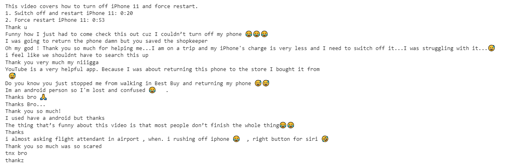

# Youtube_Scrap
Youtube Scrapping in Python

# Steps:
1. Open the Youtube_Scrap.ipynb Google Colab.
2. Enter your api_key and video_id
3. Run the code

# Generating a YouTube API key:
1. Create a Project:
2. Go to the Google Cloud Console.
Click on the project dropdown (near the top of the page) and select "New Project."
Enter a name for your project and click "Create."
Enable the YouTube Data API:
3. In the Google Cloud Console, navigate to the "APIs & Services" > "Dashboard" page.
Click on the "+ ENABLE APIS AND SERVICES" button.
Search for "YouTube Data API" and select it.
Click the "Enable" button.
Create API Credentials:
4. After enabling the YouTube Data API, click on the "Create Credentials" button.
Select "API key" from the dropdown menu.
A dialog will appear displaying your API key. You may restrict your API key to specific websites or apps if desired.
Restrict API Key (Optional):
5. (Optional) You can restrict the usage of your API key to specific websites or apps to enhance security. To do this, click on "Restrict key" after creating the API key.
Set up API key restrictions as needed (e.g., HTTP referrers).
Copy API Key:
6. Copy the generated API key and paste it instead of Your_Api_Key. Keep this key secure and do not share it publicly.

# Generating Youtube Video Id:
A YouTube video ID is a unique identifier assigned to each video on the platform. The YouTube video ID is part of the video's URL.
Here are a few examples of YouTube video IDs:
1. In the URL https://youtu.be/07cKD8GK__c?feature=shared, the video ID is 07cKD8GK__c
2. In the URL https://www.youtube.com/watch?v=dQw4w9WgXcQ, the video ID is dQw4w9WgXcQ.

Copy the video id and paste it instead of Your_Video_Id.

# Output:

